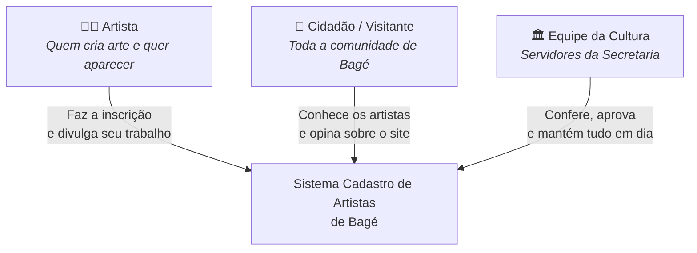
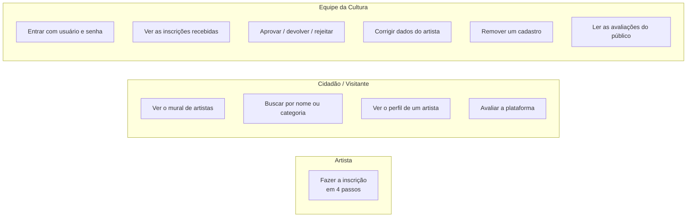
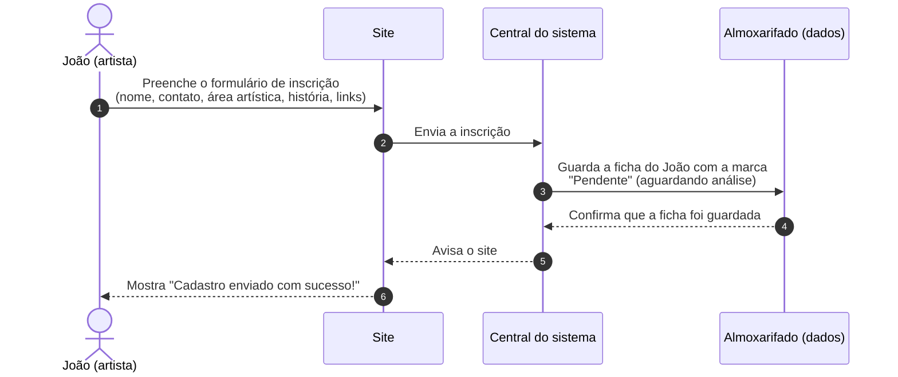
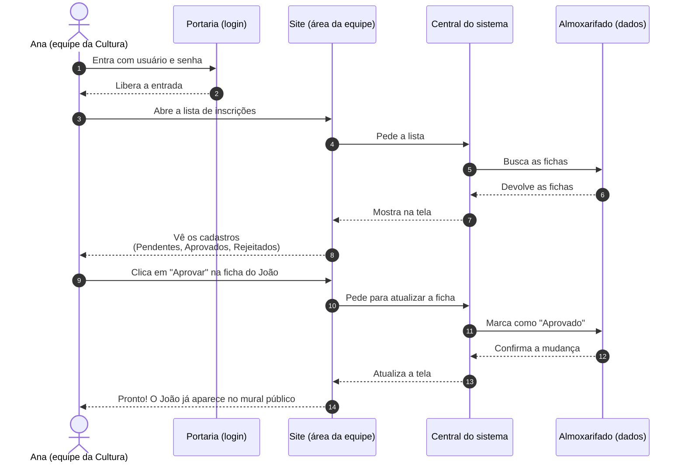
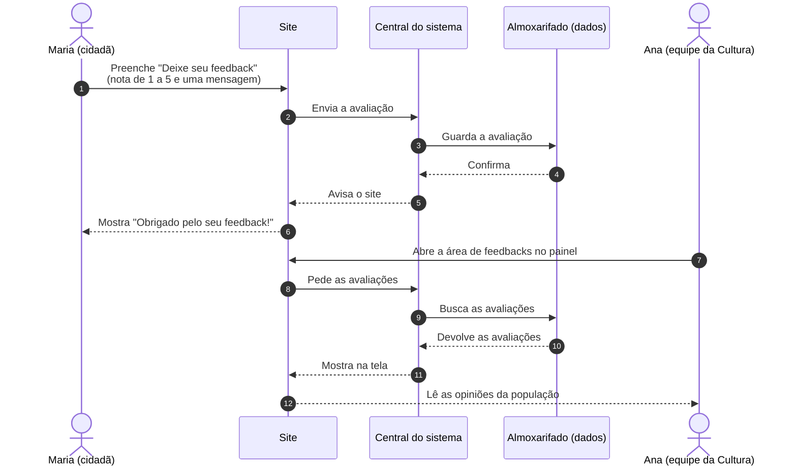
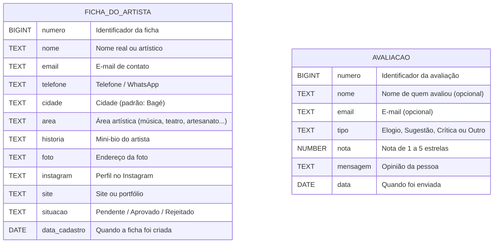
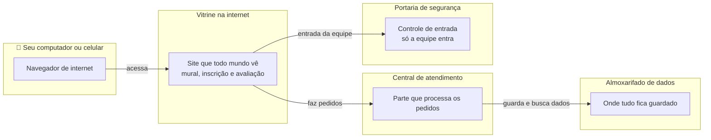
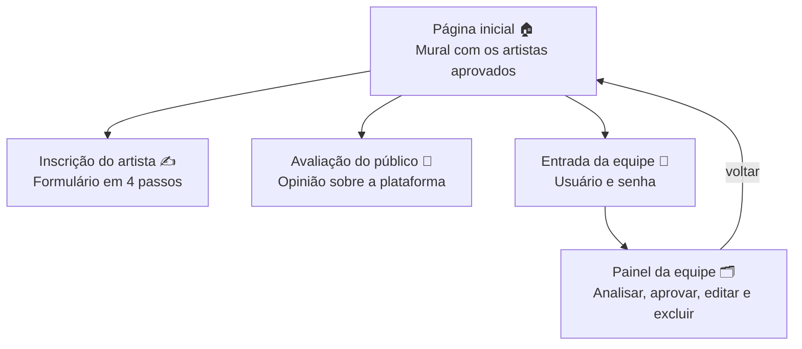

# Ilustração do Sistema - Cadastro Municipal de Artistas

Este documento explica, de forma simples e visual, o sistema de **Cadastro Municipal de Artistas** de Bagé. Os diagramas usam o formato **Mermaid**, que pode ser visto direto no GitHub (é só trocar a aba para "Preview" ou abrir pelo próprio site do GitHub).

---

## 1. Quem usa o sistema

O sistema tem três tipos de usuários. Cada um tem seu papel:

---

## 2. O que dá para fazer no sistema

Resumo dos recursos, organizados por quem usa:

---

## 3. Jornada: como um artista se cadastra

A história do João, artista de Bagé, usando o sistema pela primeira vez:

Limpeza: a ficha do João **não aparece no mural público** até ser aprovada pela equipe.

---

## 4. Jornada: como a equipe analisa e aprova

A história da Ana, da Secretaria de Cultura, cuidando das inscrições:

---

## 5. Jornada: a opinião do público (feedback)

A história da Maria, que visitou o site e quer dar sua avaliação:

---

## 6. O que o sistema guarda

As informações são salvas em duas "gavetas" do almoxarifado:

---

## 7. Como o sistema funciona por dentro

Uma visão simples de como as peças se encaixam na internet:

---

## 8. Mapa do site

As páginas do sistema e como elas se ligam:

