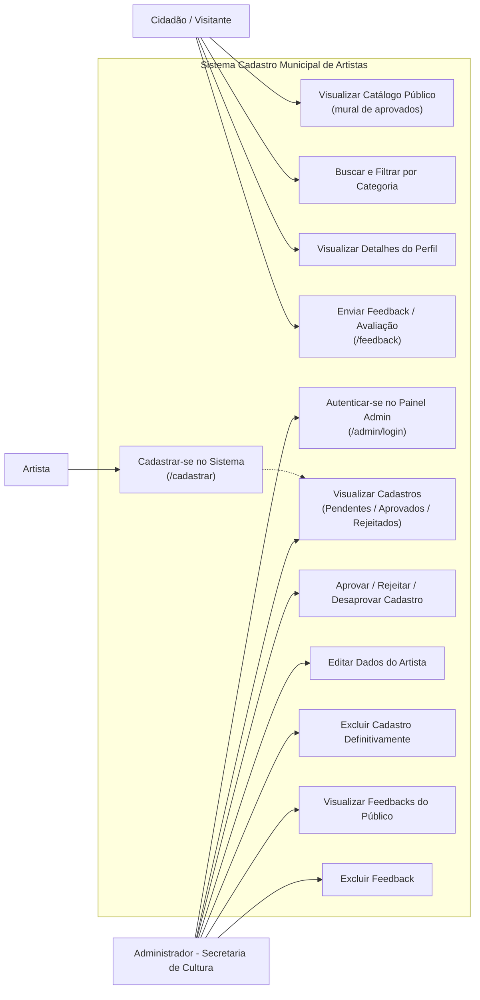
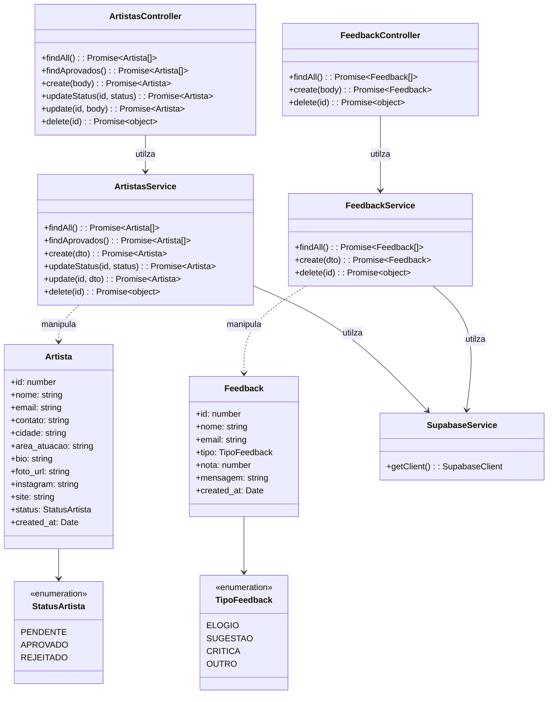
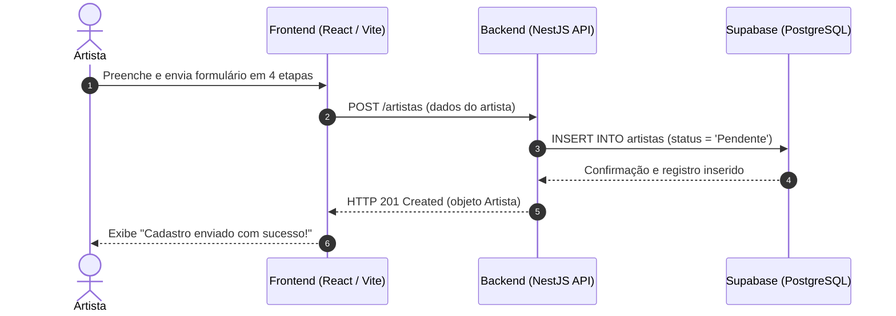
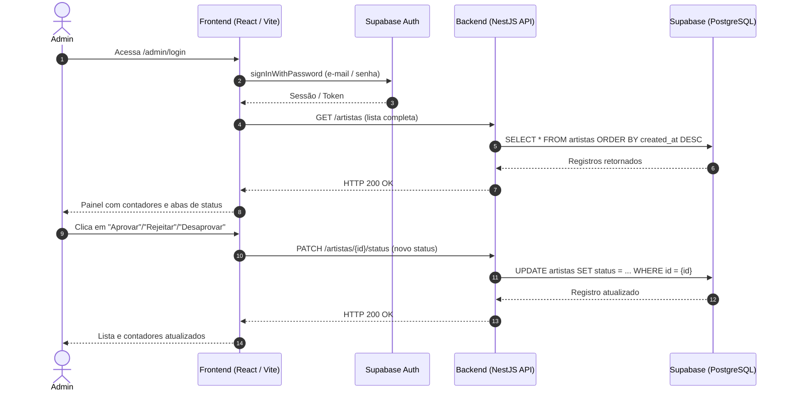
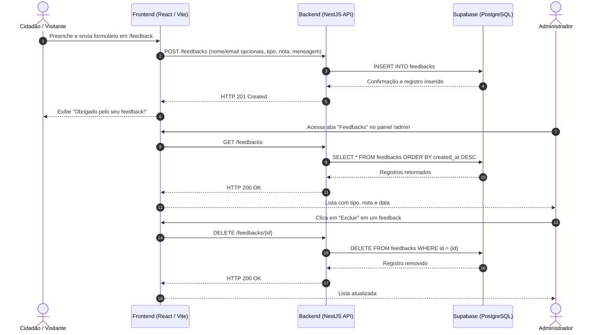
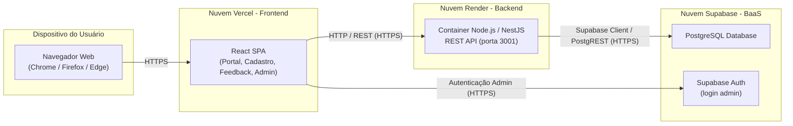
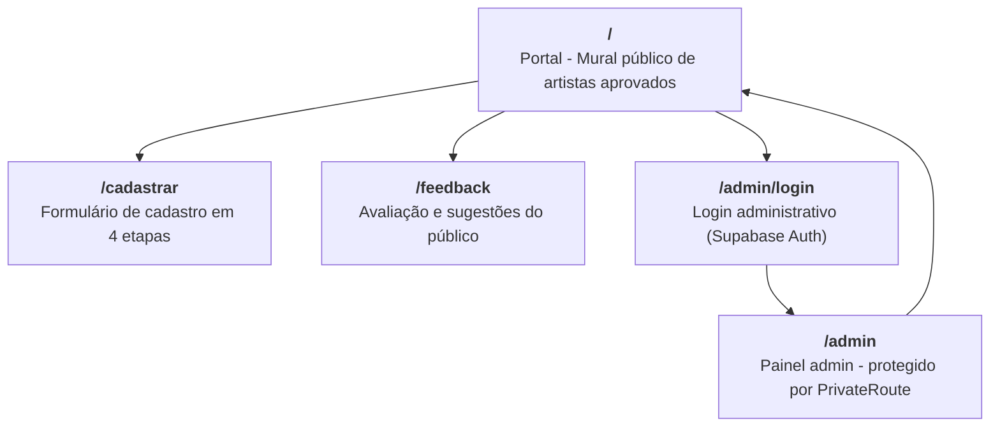

# Diagramas Mermaid - Cadastro Municipal de Artistas

Este documento reúne os diagramas do sistema **Cadastro Municipal de Artistas** em formato **Mermaid**, que renderizam nativamente em visualizadores como o GitHub, GitLab e editores Markdown. Cobrem a arquitetura completa, incluindo o módulo de Feedback do Público.

---

## 1. Diagrama de Casos de Uso



---

## 2. Diagrama de Classes (Camada Técnica)



---

## 3. Diagrama de Sequência: Cadastro de Artista



---

## 4. Diagrama de Sequência: Moderação Administrativa



---

## 5. Diagrama de Sequência: Fluxo de Feedback do Público



---

## 6. Diagrama de Entidade-Relacionamento (Banco de Dados)

```mermaid
erDiagram
    ARTISTAS {
        BIGINT id PK "IDENTITY"
        TEXT nome
        TEXT email
        TEXT contato
        TEXT cidade DEFAULT 'Bagé'
        TEXT area_atuacao
        TEXT bio
        TEXT foto_url
        TEXT instagram
        TEXT site
        TEXT status "Pendente/Aprovado/Rejeitado"
        TIMESTAMPTZ created_at
    }

    FEEDBACKS {
        BIGINT id PK "IDENTITY"
        TEXT nome
        TEXT email
        TEXT tipo "Elogio/Sugestão/Crítica/Outro"
        INTEGER nota "CHECK 1..5"
        TEXT mensagem
        TIMESTAMPTZ created_at
    }
```

---

## 7. Diagrama de Implantação / Arquitetura



---

## 8. Mapa de Rotas da Aplicação

