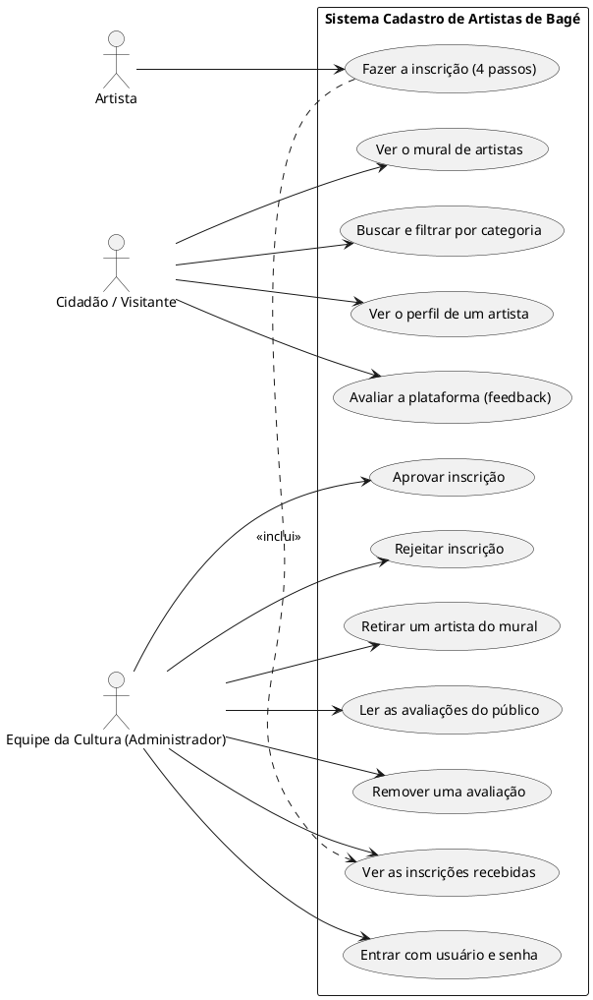
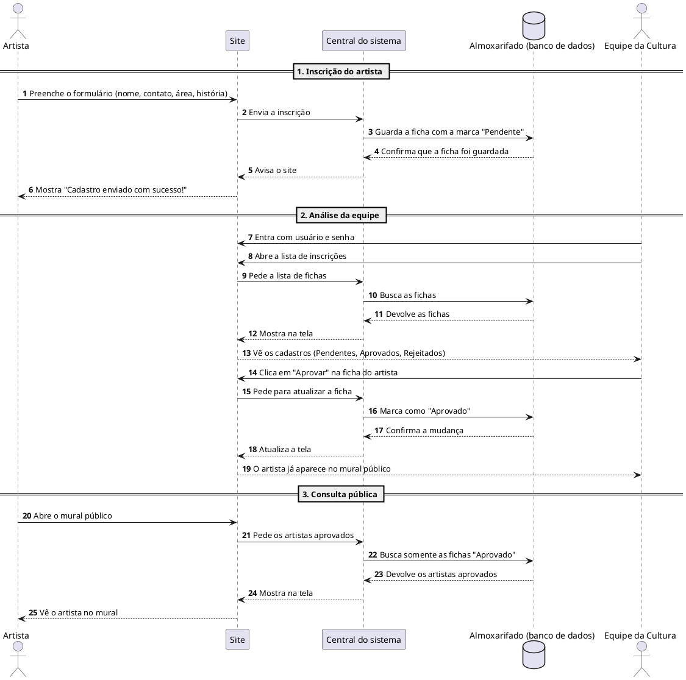
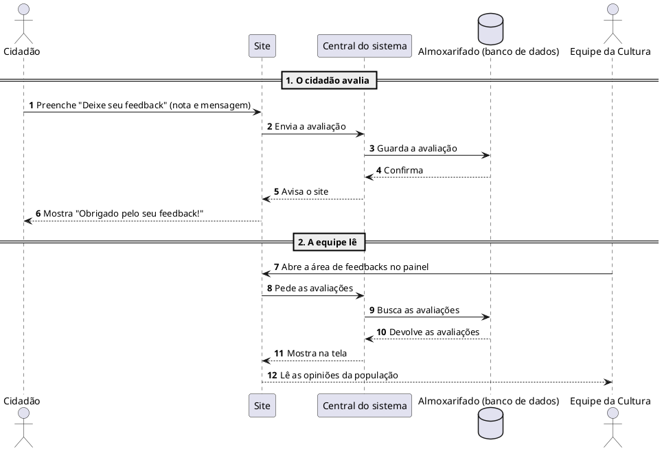
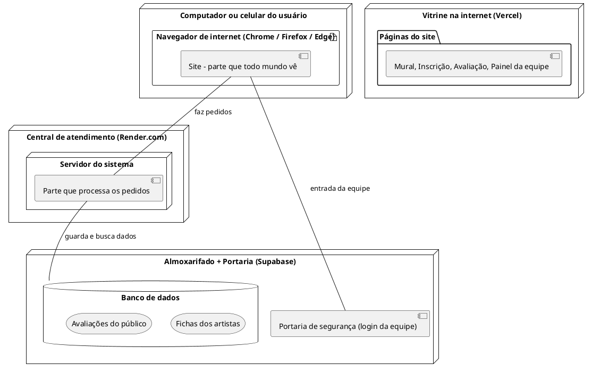

# Diagramas UML - Cadastro Municipal de Artistas

Este documento reúne os diagramas do sistema **Cadastro Municipal de Artistas** em formato **PlantUML**, com linguagem simples para ser apresentado à equipe da Secretaria de Cultura e ao Conselho Municipal de Políticas Culturais. Os códigos podem ser copiados e colados em editores como o [PlantText](https://www.planttext.com/) ou o servidor oficial do [PlantUML](http://www.plantuml.com/plantuml/).

---

## 1. Diagrama de Casos de Uso

Mostra **quem** usa o sistema e **o que** cada um pode fazer:



---

## 2. Diagrama de Entidades e Perfis

Mostra quem participa do sistema e **o que é guardado** sobre cada pessoa:

```plantuml
@startuml Diagrama_de_Entidades
skinparam classAttributeIconSize 0
skinparam shadowing false

actor "Artista" as A
actor "Cidadão / Visitante" as V
actor "Equipe da Cultura" as E

class "Ficha do Artista" {
  nome
  email
  telefone
  cidade
  área artística
  mini-bio
  foto
  instagram
  site
  situação: Pendente / Aprovado / Rejeitado
  data do cadastro
}

class "Avaliação (Feedback)" {
  nome (opcional)
  email (opcional)
  tipo: Elogio / Sugestão / Crítica / Outro
  nota (1 a 5)
  mensagem
  data
}

A --> "Ficha do Artista" : preenche
V --> "Avaliação (Feedback)" : envia
E --> "Ficha do Artista" : analisa e muda a situação
E --> "Avaliação (Feedback)" : lê e pode remover
@enduml
```

---

## 3. Diagrama de Sequência: Inscrição e Aprovação

A jornada completa, da inscrição de um artista até ele aparecer no mural público:



---

## 4. Diagrama de Sequência: Avaliação do Público (Feedback)

Do momento em que o cidadão dá sua opinião até a equipe ler:



---

## 5. Diagrama de Implantação (Onde o sistema mora)

Uma visão simples de como as partes do sistema se conectam na internet:

