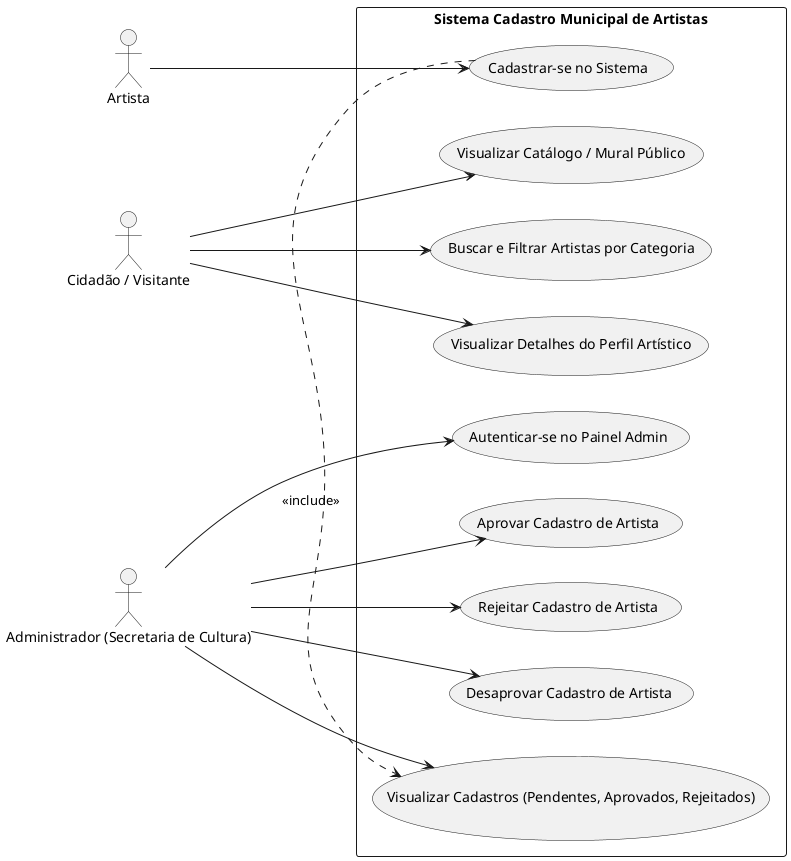
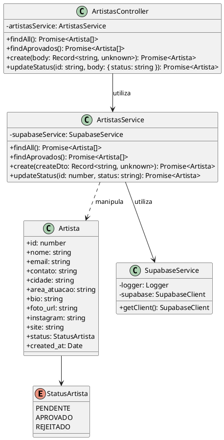
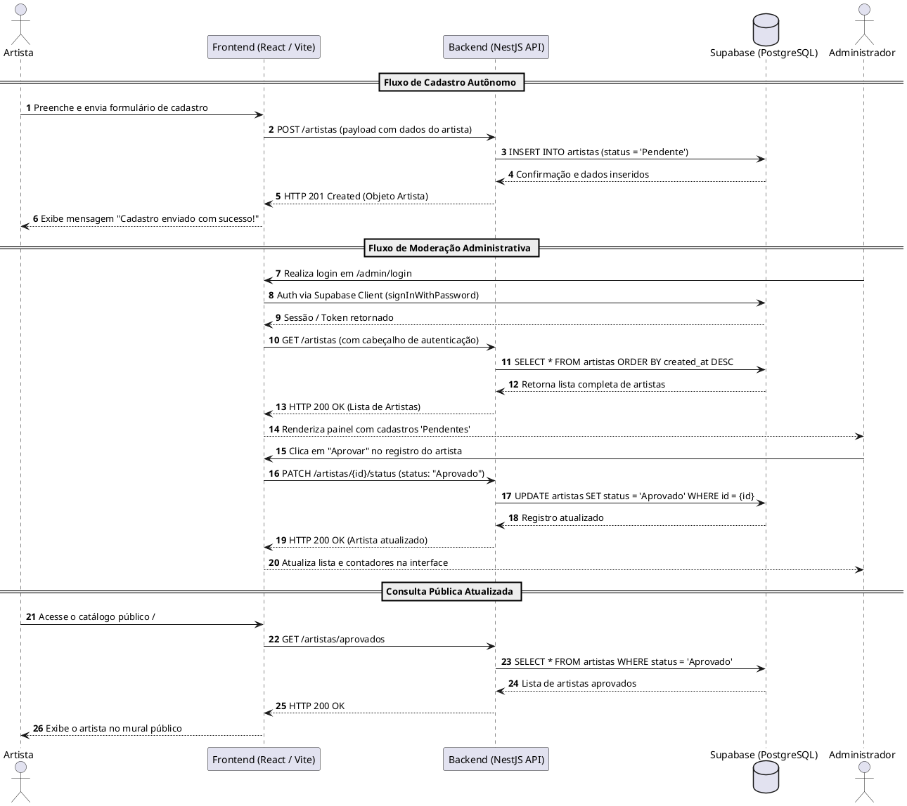

# Diagramas UML - Cadastro Municipal de Artistas

Este documento reúne a especificação em código **PlantUML** dos principais diagramas de modelagem do sistema Cadastro Municipal de Artistas. Os códigos abaixo podem ser copiados e colados em editores como o [PlantText](https://www.planttext.com/) ou o servidor oficial do [PlantUML](http://www.plantuml.com/plantuml/).

---

## 1. Diagrama de Casos de Uso



---

## 2. Diagrama de Classes (Domínio e Serviços)



---

## 3. Diagrama de Sequência: Cadastro de Artista e Aprovação



---

## 4. Diagrama de Implantação / Arquitetura

```plantuml
@startuml Diagrama_de_Implantacao
skinparam nodeAttributeIconSize 0
skinparam shadowing false

node "Dispositivo do Usuário" {
  artifact "Navegador Web (Chrome / Firefox / Edge)" {
    component "React SPA App (Vercel)" as SPA
  }
}

node "Nuvem Vercel (Hospedagem Frontend)" {
  folder "Estáticos & Assets" {
    [HTML5 / JS / CSS]
  }
}

node "Nuvem Render.com (Hospedagem Backend)" {
  node "Container Node.js / NestJS" {
    component "REST API Service (Porta 3001)" as API
  }
}

node "Nuvem Supabase (BaaS)" {
  database "PostgreSQL Database" as DB_Postgres {
    table "artistas"
  }
  component "Supabase Auth Service" as Auth
}

SPA -- API : HTTP / REST (HTTPS)
SPA -- Auth : Autenticação Admin (HTTPS)
API -- DB_Postgres : Supabase Client (PostgREST API / HTTPS)
@enduml
```
